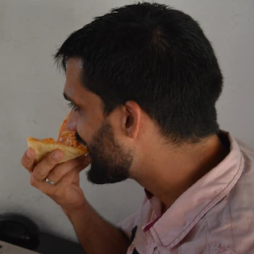
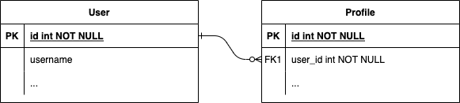
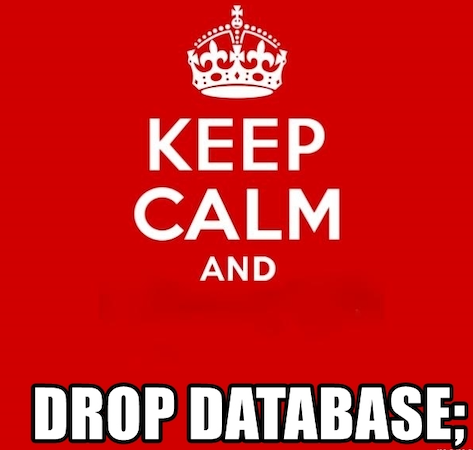

class: middle center


---

## 👋 Hola

.left-column-66[

#### Lorenzo Peña

-   Oriental de Holguín
-   Djangonauta hace 12 años
-   Fan de la pizza con atún

]
.right-column-33[]

---

name: title
class: middle center


---

class: middle center


---

template: title

--

7️⃣ cosas que el yo del presente quisiera decirle al yo del pasado al empezar un projecto de Django de cero

---

layout: true

## Lista de viaje al pasado

---

---

.left-column-66[

1. Apps
2. `auth.User`
3. `Model.clean`
4. Queries
5. Idealismo en la BD
6. Otras pequeñas cosas
7. A quién escuchar

]

--

.right-column-33[]

---

layout: true

## Las apps de Django no son lo que parecen

---

---

<br/>

.center[

```shell
python manage.py startapp <app>
```

]

---

.center[]

---

.center[]

---

layout: false
class: middle center

# Una sola app es suficiente para empezar

---

layout: true

## Aléjate de django.contrib.auth.models.User

---

---

<br/>

##### .center[Antes de Django 1.5 ]

.center[]

---

.center[]

---

layout: false
class: middle center

# Empieza de cero con un User personalizado

---

layout: true

## Model.clean te va a decepcionar

---

---

.center[]

---

<br/>

> Validar un huevo es fácil,
> <br/>un cartón son otros .strike[20 ]300 pesos.
> <br/> .center[---Anónimo]

---

.left-column[

##### .blue[Persistencia]

```python
Model.clean()
```

]

.right-column[

##### .blue[Entrada]

```python
Form.clean()
Serializer.validate()
```

]

--

.right-column-33[☝️ ☝️]

---

layout: false
class: middle center

# Valida en la capa de entrada

---

layout: true

## Las Queries son tus amigas

---

---

background-image: url(images/invoice.png)

---

.left-column[]

--

.right-column[
.strike[`Model.objects.all()`]

```
Model.objects
    .select_related(🚂)
    .prefetch_related(🏠)
    .annotate(🐘)
```

]

---

layout: false
class: middle center

# Piensa más en queries que en models

---

layout: false
class: middle center

# Usa managers y queries personalizadas

---

layout: true

## Rompe la base de datos

---

---

.center[]

---

##### .blue[Rompe tu manera de pensar en la base de datos]

--

-   no siempre necesitas `unique=True` y `unique_together`

--

-   se puede tener `null=True` aunque el campo sea "requerido"

--

-   la 🌈 felicidad **NO** es una base de datos normalizada

---

layout: false
class: middle center

# No resuelvas en la base de datos lo que puedes resolver en código

---

layout: false
class: middle center

# Optimización >> Normalización

---

layout: true

## Otras pequeñas cosas

---

---

-   Escribe tests, optimízalos

--

-   `assertNumQueries` existe y es muy útil

--

-   Usa signals, pero como último recurso

--

-   No reinventes la rueda ni descubras el agua tibia

--

-   Ni `pipenv` ni `poetry` son la panacea 🔥

---

layout: true

## No todo lo que brilla es oro

---

---

.center[]

---

layout: true

## Y se acabó el tiempo

---

##### Puedes encontrarme aquí:

|         |                                                    |
| ------- | -------------------------------------------------- |
| Twitter | [@lorinkoz](https://twitter.com/lorinkoz)          |
| GitHub  | [github.com/lorinkoz](https://github.com/lorinkoz) |
| Correo  | [lorinkoz@gmail.com](mailto:lorinkoz@gmail.com)    |

---

template: title
