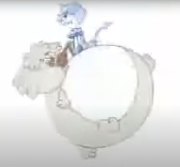

## 👋 Hola

.left-column-66[

#### Lorenzo Peña

-   Oriental de Holguín
-   Djangonauta hace 12 años
-   Fan de la pizza con atún

]
.right-column-33[]

---

name: title
class: middle center

---

class: middle center

---

template: title

--

7+ cosas que el yo del presente quisiera decirle al yo del pasado al empezar un projecto de Django de cero

---

layout: true

## Django apps

---

--

???

Las apps de Django no son lo que parecen

---

layout: true

## django.contrib.auth.models.User

---

--

???

Empieza de cero con un User model personalizado

---

layout: true

## Fat models?

---

--

???

El modelo no es realmente el lugar perfecto para poner toda la lógica del negocio

---

layout: true

## El dilema de la validación

---

--

???

Valida en la capa de entrada del usuario

---

layout: true

## Donde dije Models, digo Queries

---

--

???

-   Piensa en Queries, no en Models
-   Usa los Managers y Queries

---

layout: true

## Rompe la base de datos

---

--

???

-   Relaja la base de datos
-   Evita las restricciones
-   Resuelve con código mientras puedas

---

layout: true

## Otras pequeñas cosas

---

--

-   Escribe tests, optimiza los tests

---

layout: true

---

## No todo lo que brilla es oro

--

???

Cuidado con la "buenas prácticas" que aparecen por ahí

---

layout: true

## Y se acabó el tiempo

---

##### Puedes encontrarme aquí:

|         |                                                    |
| ------- | -------------------------------------------------- |
| Twitter | [@lorinkoz](https://twitter.com/lorinkoz)          |
| GitHub  | [github.com/lorinkoz](https://github.com/lorinkoz) |
| Correo  | [lorinkoz@gmail.com](mailto:lorinkoz@gmail.com)    |

---

template: title
